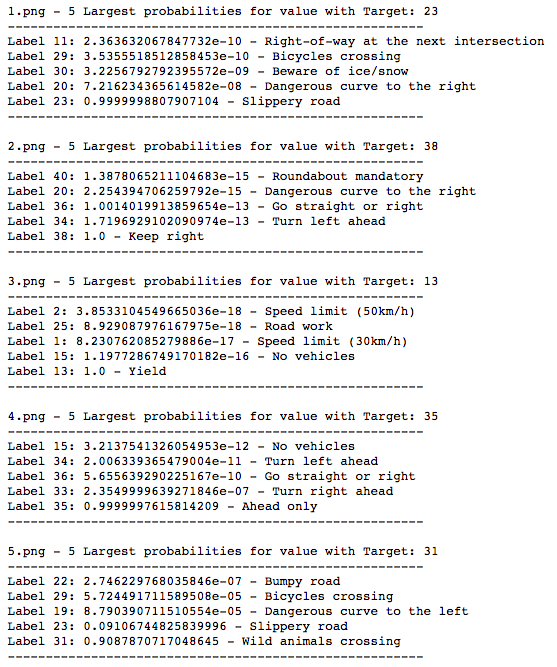

#**Traffic Sign Recognition** 

---

**Build a Traffic Sign Recognition Project**

The goals / steps of this project are the following:

* Load the data set (see below for links to the project data set)
* Explore, summarize and visualize the data set
* Design, train and test a model architecture
* Use the model to make predictions on new images
* Analyze the softmax probabilities of the new images
* Summarize the results with a written report

## Rubric Points
###Here I will consider the [rubric points](https://review.udacity.com/#!/rubrics/481/view) individually and describe how I addressed each point in my implementation.  

---
###Writeup / README

You're reading it! and here is a link to my [project code](https://github.com/ValeryToda/CarND-Traffic-Sign/blob/master/Traffic_Sign_Classifier.ipynb)

###Data Set Summary & Exploration

I used the numpy library to calculate summary statistics of the traffic
signs data set:

* The size of training set is 34799
* The size of the validation set is 4410
* The size of test set is 12630
* The shape of a traffic sign image is 32x32 pixels
* The number of unique classes/labels in the data set is 43

####2. Include an exploratory visualization of the dataset.

Here is an exploratory visualization of the data set. It is a bar chart showing how the data are distributed.

###Design and Test a Model Architecture

####1. Describe how you preprocessed the image data. What techniques were chosen and why did you choose these techniques? Consider including images showing the output of each preprocessing technique. Pre-processing refers to techniques such as converting to grayscale, normalization, etc. 

First i converted the images as grayscale and train the provided LeNet network with them. After trying many combinations of network parameters (number of network layers, learning rate, training optimizer, dropout, weights normalization) i realized that there is actually no big difference in the performance of the provided network in comparison with the training with coloured images. So, i finally opted for the coloured images.

I normalized the image data to scale the values down between 0 and 1. It helps gradient descent to converge faster.

I decided to generate additional data just to test the impact of more data in combination with various network configurations. Finally I abandoned the data augmentation because i was able to find a network configuration good enough to reach a 99% training accuracy. The same reason apply to the rescale of the images intensities. 

####2. Describe what your final model architecture looks like including model type, layers, layer sizes, connectivity, etc.) Consider including a diagram and/or table describing the final model.

My final model consisted of the following layers:

I decided to design my network keeping 4 levels in mind. In analogy to the description provided [here](https://wiki.tum.de/display/lfdv/Convolutional+Neural+Networks): 

* The low level feature level (conv2d_1, conv2d_2, maxpool2d_1)
* The mid level feature level (conv2d_3, conv2d_4, maxpool2d_2)
* The high level feature level (fc_1, fc_2, maxpool2d_3)
* The classifier level (fc_3, fc_4)

####3. Describe how you trained your model. The discussion can include the type of optimizer, the batch size, number of epochs and any hyperparameters such as learning rate.

To train the model, I used the Stochastic gradient descent optimizer with a time based learning rate scheduling as described in this [post](http://machinelearningmastery.com/using-learning-rate-schedules-deep-learning-models-python-keras/). 

####4. Describe the approach taken for finding a solution and getting the validation set accuracy to be at least 0.93. Include in the discussion the results on the training, validation and test sets and where in the code these were calculated. Your approach may have been an iterative process, in which case, outline the steps you took to get to the final solution and why you chose those steps. Perhaps your solution involved an already well known implementation or architecture. In this case, discuss why you think the architecture is suitable for the current problem.

My final model results were:

* training set accuracy of 99%
* validation set accuracy of 98% 
* test set accuracy of 96.7%

My approach was based on a trial and error basis. I was discouraged to replicate classic models like AlexNet, VGG Net or GoogleNet because they all have to much trainable parameters and therefore need more power/time to compute. I started with the provided Network (LeNet) with adding kernel initializers and dropout at all layers. It had not help because the network was underfitting. At some point I get frustrated with Tensorflow because i felt distracted with trying to get Tensorflow working instead of focussing on the network optimization. I switched to Keras and started fresh with a replica of the provided LeNet network and keep tuning the number and the depth of layers. The real improvement in the convergence came with the setting of batch normalization after each level and the learning rate scheduling. The network was able to reach 98% validation accuracy after just 20 epochs. I trained the model with 150 epochs and realized that there was no improvement over the time after 100 epochs. The classification report shows that the precision and the recall are mostly both high for all classes apart from the classes pedestrians and double curves. It is a good sign that the model is working well. The confusion matrix confirms that the model is performing good overall apart from particularly the two earlier mentioned classes (pedestrians, double curves). 

#### Training report

#### confusion matrix

###Test a Model on New Images

####1. Choose five German traffic signs found on the web and provide them in the report. For each image, discuss what quality or qualities might be difficult to classify.

Here are five German traffic signs that I found on the web:

The images are not noisy and should be easy to classify.

####2. Discuss the model's predictions on these new traffic signs and compare the results to predicting on the test set. At a minimum, discuss what the predictions were, the accuracy on these new predictions, and compare the accuracy to the accuracy on the test set 

Here are the results of the prediction:

The model was able to correctly guess 5 of the 5 traffic signs, which gives an accuracy of 100%. and confirm the test accuracy of the trained model.

####3. Describe how certain the model is when predicting on each of the five new images by looking at the softmax probabilities for each prediction. Provide the top 5 softmax probabilities for each image along with the sign type of each probability. 

The top five soft max probabilities were:

